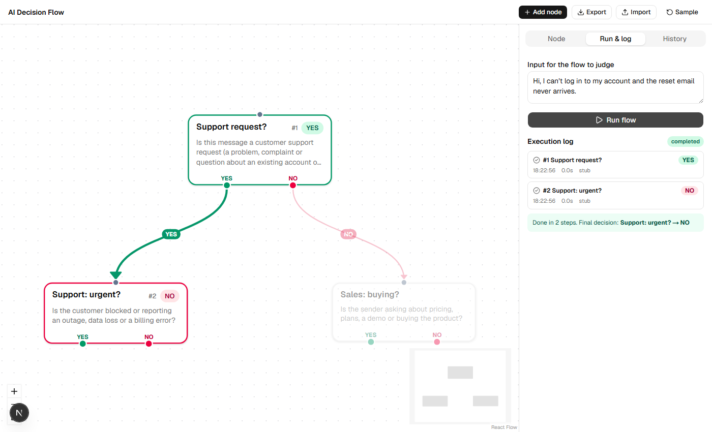
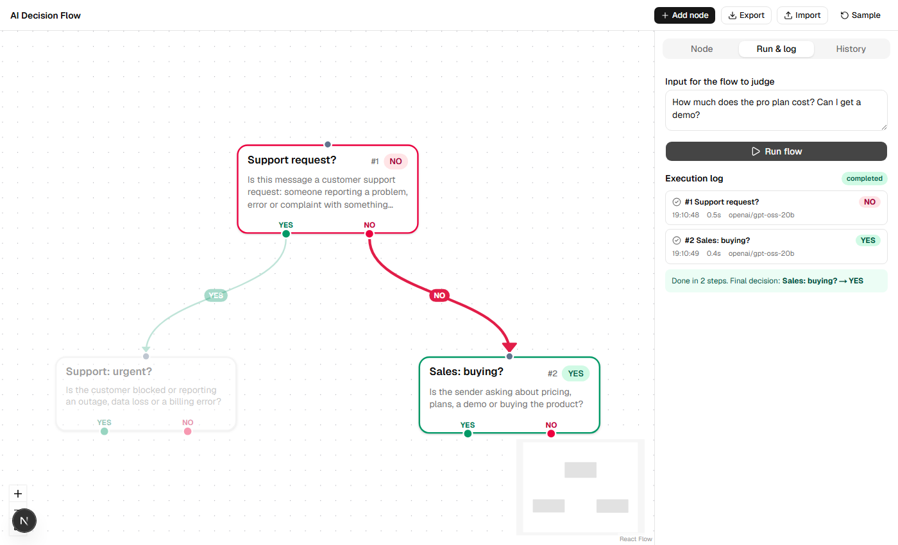
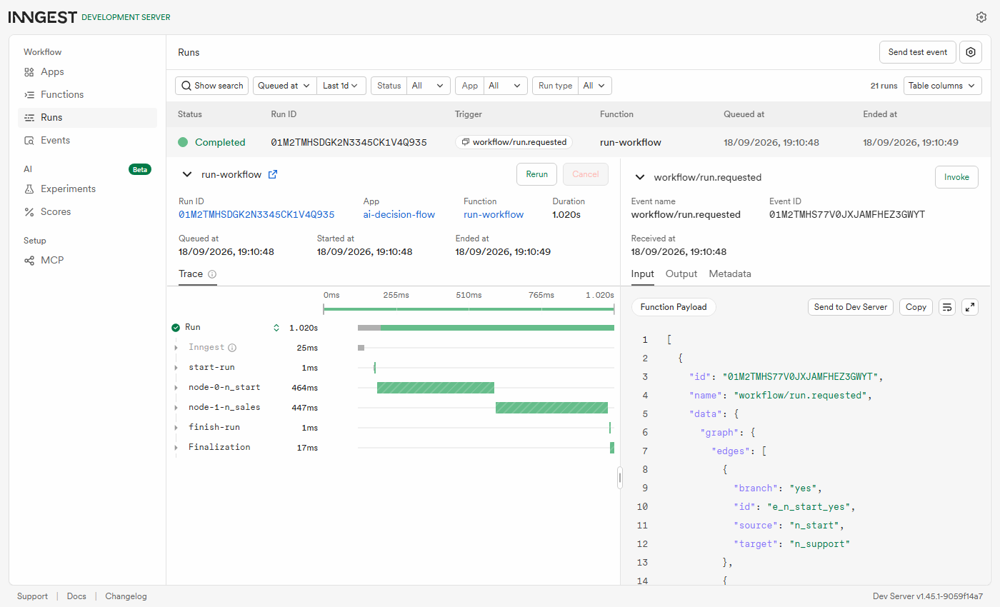
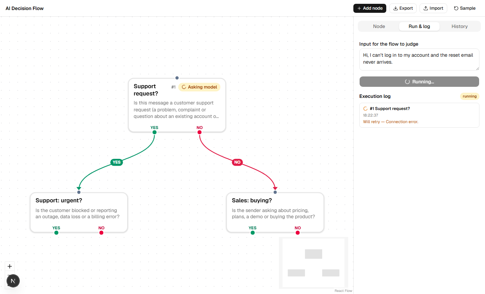

# AI Decision Flow

A visual workflow builder where every node is an AI decision that answers **YES** or **NO**. You draw the flow on a [React Flow](https://reactflow.dev) canvas; running it executes the flow durably through [Inngest](https://www.inngest.com), one Inngest step per node, with an LLM deciding which branch to follow.



*A support message, judged by `openai/gpt-oss-20b` on Groq. The path taken is bold, the untaken branch fades, and the log shows each step with the model's answer and timing.*

The same flow with a sales message takes the other branch:



```
"Is this a support request?"
   ├─ YES → "Is the customer blocked or reporting an outage…?"
   └─ NO  → "Is the sender asking about pricing or a demo?"
```

## Quick start

Requires Node 20+ (developed on 22).

```bash
npm install
cp .env.example .env.local     # then edit — see below
npm run dev                    # terminal 1 → http://localhost:3000
npm run inngest                # terminal 2 → Inngest dev UI at http://localhost:8288
```

Both processes need to be running: the app serves the UI and the workflow code, the Inngest dev server schedules and runs the steps by calling back into `http://localhost:3000/api/inngest`.

### Configuring the model

Any OpenAI-compatible provider works; the OpenAI SDK is pointed at it with three variables in `.env.local` (`LLM_BASE_URL`, `LLM_API_KEY`, `LLM_MODEL`; two optional tuning variables are described below):

| Provider | `LLM_BASE_URL` | `LLM_MODEL` (example) |
| --- | --- | --- |
| Groq (free tier) — used for the screenshots | `https://api.groq.com/openai/v1` | `openai/gpt-oss-20b` |
| OpenAI | `https://api.openai.com/v1` | `gpt-4o-mini` |
| OpenRouter | `https://openrouter.ai/api/v1` | `openrouter/free` |
| Ollama (local) | `http://localhost:11434/v1` (`LLM_API_KEY=ollama`) | `llama3.2` |

Groq retires models from time to time (a `404 … model does not exist` means the name is stale); `curl https://api.groq.com/openai/v1/models -H "Authorization: Bearer $LLM_API_KEY"` lists what your key can use.

Reasoning models such as `gpt-oss` think before answering, and that thinking counts against the token cap. `LLM_MAX_TOKENS` (default 512) leaves room for it, and `LLM_REASONING_EFFORT=low` keeps a one-word answer fast (~0.4 s per node). Leave the effort unset for models that don't reason.

No key yet? Set `LLM_STUB=1` and the whole app runs against a keyword heuristic instead of a model. It's only for exercising the plumbing (steps, branching, UI) and is never used unless you turn it on.

## Using it

1. **Edit the flow.** Select a node to change its label and prompt (the **Node** tab). **Add node** creates one. Drag from a node's green **YES** or red **NO** dot to another node to connect them; drop anywhere on the target node. Select a node or connection and press Delete to remove it.
2. **Run it.** In **Run & log**, type the text to judge and press **Run flow**. Nodes light up as they're asked, the chosen edge animates, and the log lists every step.
3. **Look back.** **History** lists past runs; click one to replay its path on the canvas.
4. **Keep it.** The flow autosaves to your browser (localStorage). **Export** / **Import** move it as a JSON file.

## How it works

```
Browser (React Flow)                     Next.js server                         Inngest dev server
────────────────────                     ──────────────                         ──────────────────
POST /api/runs {graph, input} ─────────▶ validate graph, create run record
                                         inngest.send("workflow/run.requested") ─▶ queue the run
                                                                                    │
                                         /api/inngest ◀───── invoke run-workflow ◀──┘
                                           step.run("node-0-…")  ── LLM ──▶ YES/NO
                                           follow the YES or NO edge
                                           step.run("node-1-…")  ── LLM ──▶ YES/NO
                                           …no edge for that answer → finish
poll GET /api/runs/:id  ◀──────────────  run record (steps, answers, errors)
```

- **One node = one Inngest step.** `src/inngest/functions.ts` walks the graph from the start node. Each node's LLM call is its own `step.run("node-<n>-<id>")`, so it is retried, memoised and visible in the Inngest dashboard independently: if node 3 fails, nodes 1 and 2 are not asked again.
- **The model may only say YES or NO.** The system prompt demands one word, and `src/lib/answer.ts` reads the reply strictly: case, quotes, a trailing period and `<think>` blocks are tolerated; `"Yes, because…"` is not. A bad reply fails the step and Inngest retries it.
- **Branching.** After a node answers, the function follows the edge drawn for that answer. If the user didn't draw one, the flow ends at that node, and its answer is the final decision.
- **Execution order** is the step index (`#1`, `#2`, …), stored in the run record and shown on the node, in the log, and in history.
- **Progress reaches the browser** through a small run store (`src/lib/run-store.ts`): the workflow writes to it inside each step, the UI polls `GET /api/runs/:id` every 600 ms.

Each node shows up as its own step in the Inngest dev dashboard (`http://localhost:8288`), with its own timing:



### Edge types

There are two edge types, `yes` and `no` (`src/components/flow/branch-edge.tsx`), green and red with a label. Each node has one YES exit and one NO exit: connecting a second edge from the same exit replaces the first. Loops are refused while you draw, and rejected again by the server.

### Error handling and retries

| Situation | What happens |
| --- | --- |
| Network error, timeout, 429, 5xx, or a reply that isn't YES/NO | The step is retried by Inngest (`retries: 3`, with backoff). The log shows *"Will retry — …"* and the node shows the try number. |
| Missing key/model, or a 400/401/403/404/422 from the provider | Marked non-retriable: the run fails immediately with the reason. |
| Retries exhausted | `onFailure` marks the run and the failing node as **failed**. |
| Inngest dev server not running | The run request returns a clear error (502) instead of hanging; a run stuck queued for 8 s shows a hint. |
| Invalid flow (two start nodes, empty prompt, loop…) | **Run** is disabled and the reasons are listed; the API re-checks and returns 400. |
| Bad import file | A message explains what's wrong; the current flow is untouched. |



## Assignment coverage

| Phase | What | Where |
| --- | --- | --- |
| 1 Setup | Next.js + React Flow + Inngest + OpenAI SDK + shadcn, env config, project structure | `package.json`, `.env.example`, `src/` |
| 2 Foundations | Canvas, add / connect / delete nodes, editable prompts, YES and NO edge types, state stored locally | `flow-app.tsx`, `inspector.tsx`, `flow-store.ts`, `branch-edge.tsx` |
| 3 Core | Inngest step per node, prompt to LLM, YES/NO only, follow the chosen edge, execution order | `inngest/functions.ts`, `lib/llm.ts`, `lib/graph.ts` |
| 4 Polish (picked 6 of 9) | Visual execution state · Animated active edges · Execution logs panel · JSON export/import · Error handling · Execution history | `run-view.ts`, `run-panel.tsx`, `history-panel.tsx`, `flow.ts` |

Retry of failed nodes is covered automatically by Inngest's per-step retries rather than a manual button.

## Project structure

```
src/
  app/
    api/inngest/route.ts        serves the workflow to Inngest
    api/runs/route.ts           POST start a run · GET history
    api/runs/[runId]/route.ts   GET one run (polled by the UI)
  inngest/
    client.ts                   Inngest client + event name
    functions.ts                the workflow: one step per node
  lib/
    graph.ts                    graph types, validation, traversal (pure, shared)
    answer.ts                   strict YES/NO parser
    llm.ts                      the only module that talks to a model
    run-store.ts                run progress (in memory + .data/runs/*.json)
    run-view.ts                 run record → colours/animation on the canvas
    flow.ts, flow-store.ts      React Flow types, sample flow, JSON import/export, local persistence
  components/flow/              canvas, node, edges, inspector, run + history panels
tests/graph.test.ts             unit tests for the pure logic
```

## Scripts

| | |
| --- | --- |
| `npm run dev` | Next.js on port 3000 |
| `npm run inngest` | Inngest dev server on port 8288, pointed at the app |
| `npm test` | unit tests (Vitest) |
| `npm run typecheck`, `npm run lint` | static checks |

## Limits, on purpose

- **Run history is a local-dev store.** It lives in memory and `.data/runs/` (git-ignored) and assumes one server process. For a deployed, multi-instance app, replace `run-store.ts` with a database; its functions are the whole interface.
- **Polling, not push.** Simple route handlers, ~0.6 s latency. Inngest Realtime or SSE would be the next step.
- **Decision trees, not general graphs.** No loops, exactly one start node, one exit per answer.
- **Prompt injection.** The run input is passed to the model as quoted data and the system prompt says to ignore instructions in it, but a decision node is only as trustworthy as the model behind it. Don't let a YES/NO alone authorise anything sensitive.
- `npm audit` reports `adm-zip` via the `inngest-cli` dev dependency (used only to unpack the CLI binary at install). It doesn't touch the running app; the suggested `--force` fix downgrades the CLI to 0.16.3, so it's left alone.
